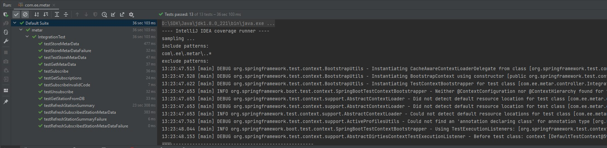
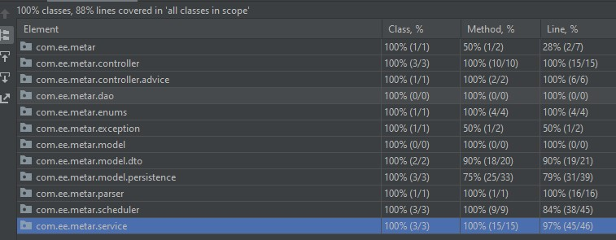
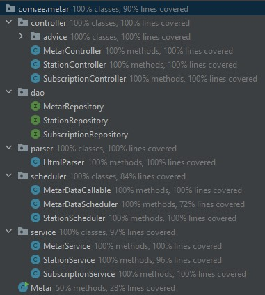
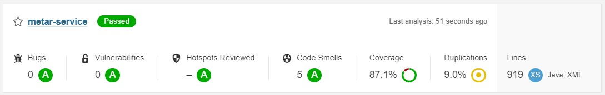

### 📚 [Demo](https://vc-iot.app/metar/api-docs/swagger-ui/index.html)

## METAR Service
A service that continuously loads and stores a subset of METAR data for the
subscribed airports, and makes that data available to clients on request.

### ✅ Prerequisites
    🔸 [Maven](https://maven.apache.org/) - Dependency Management  
    🔸 [Postgresql Database driver](https://mvnrepository.com/artifact/org.postgresql/postgresql/9.4.1212.jre7)  
    🔸 JDK 1.8 & above  
    🔸 IDE [ Eclipse / Intellij ]  

### ▶️ Running build
```javascript
> mvn clean install
[INFO] Scanning for projects...
[INFO] 
[INFO] ---------------------< com.2e.metar:metar-service >---------------------
[INFO] Building metar-service 1.0-SNAPSHOT
[INFO] --------------------------------[ jar ]---------------------------------
[INFO] 
[INFO] --- jacoco-maven-plugin:0.8.7:prepare-agent (jacoco-initialize) @ metar-service ---
[INFO] argLine set to -javaagent:C:\\Users\\vsvar\\.m2\\repository\\org\\jacoco\\org.jacoco.agent\\0.8.7\\org.jacoco.agent-0.8.7-runtime.jar=destfile=D:\\Workspace\\Interview\\2e\\metar\\metar-service\\target\\jacoco.exec
[INFO] 
[INFO] --- maven-resources-plugin:2.6:resources (default-resources) @ metar-service ---
[INFO] Using 'UTF-8' encoding to copy filtered resources.
[INFO] Copying 2 resources
[INFO] 
[INFO] --- maven-compiler-plugin:3.1:compile (default-compile) @ metar-service ---
[INFO] Nothing to compile - all classes are up to date
[INFO] 
[INFO] --- maven-resources-plugin:2.6:testResources (default-testResources) @ metar-service ---
[INFO] Using 'UTF-8' encoding to copy filtered resources.
[INFO] skip non existing resourceDirectory D:\Workspace\Interview\2e\metar\metar-service\src\test\resources
[INFO] 
[INFO] --- maven-compiler-plugin:3.1:testCompile (default-testCompile) @ metar-service ---
[INFO] Nothing to compile - all classes are up to date
[INFO] 
[INFO] --- maven-surefire-plugin:2.22.2:test (default-test) @ metar-service ---
[INFO] No tests to run.
[INFO] 
[INFO] --- jacoco-maven-plugin:0.8.7:report (jacoco-report) @ metar-service ---
[INFO] Skipping JaCoCo execution due to missing execution data file.
[INFO] 
[INFO] --- maven-jar-plugin:2.4:jar (default-jar) @ metar-service ---
[INFO] Building jar: D:\Workspace\Interview\2e\metar\metar-service\target\metar-service-1.0-SNAPSHOT.jar
[INFO] 
[INFO] --- spring-boot-maven-plugin:2.6.3:repackage (default) @ metar-service ---
[INFO] Replacing main artifact with repackaged archive
[INFO] 
[INFO] --- maven-install-plugin:2.4:install (default-install) @ metar-service ---
[INFO] Installing D:\Workspace\Interview\2e\metar\metar-service\target\metar-service-1.0-SNAPSHOT.jar to C:\Users\vsvar\.m2\repository\com\2e\metar\metar-service\1.0-SNAPSHOT\metar-service-1.0-SNAPSHOT.jar
[INFO] Installing D:\Workspace\Interview\2e\metar\metar-service\pom.xml to C:\Users\vsvar\.m2\repository\com\2e\metar\metar-service\1.0-SNAPSHOT\metar-service-1.0-SNAPSHOT.pom
[INFO] ------------------------------------------------------------------------
[INFO] BUILD SUCCESS
[INFO] ------------------------------------------------------------------------
[INFO] Total time:  8.075 s
[INFO] Finished at: 2022-03-03T18:37:11+05:30
[INFO] ------------------------------------------------------------------------
```
### 👍  On Successful run you must see the below artifact/jar
    ✔️ target/metar.jar

### ▶️ Running the application
    > java -jar metar.jar

### 📚 [Swagger](http://localhost:13131/api-docs/swagger-ui/index.html?configUrl=/api-docs/swagger-config)

### Built With
> 🔸 [Maven](https://maven.apache.org/) - Dependency Management  

### Testing & Coverage




### Sonar Report


### Setup Docker
    Step 1: Build metar-service project
    Step 2: Copy metar.jar from target to setup/share directory
    Step 3: Create Docker bridge/network 
          > docker network create -d bridge --subnet "25.0.0.0/24" metar
    Step 4: Create docker containers
          > docker-compose up -d

### Authors
> 🧑‍💻  Varun Chandresekar
